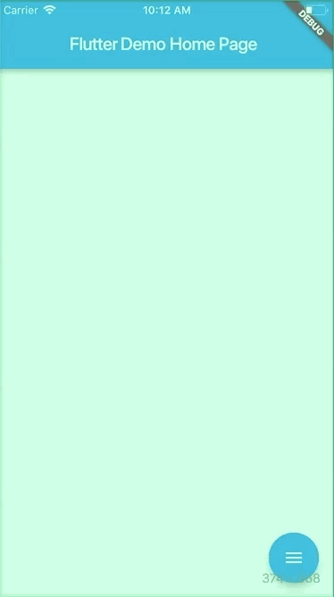

# animated_floatactionbuttons

[https:&#x2F;&#x2F;medium.com&#x2F;@agungsurya&#x2F;create-a-simple-animated-floatingactionbutton-in-flutter-2d24f37cfbcc](https://medium.com/@agungsurya/create-a-simple-animated-floatingactionbutton-in-flutter-2d24f37cfbcc)

## Getting Started

This project is a starting point for a Dart
[package](https://flutter.io/developing-packages/),
a library module containing code that can be shared easily across
multiple Flutter or Dart projects.

For help getting started with Flutter, view our 
[online documentation](https://flutter.io/docs), which offers tutorials, 
samples, guidance on mobile development, and a full API reference.

##Screenshots



## Usage

To use this plugin:

In your flutter project add the dependency:

```yalm
dependencies:
    ...
    animated_floatactionbuttons: 0.0.1
```

## Example

```dart
//Import package
import 'package:animated_floatactionbuttons/animated_floatactionbuttons.dart';
...
Widget float1() {
    return Container(
      child: FloatingActionButton(
        onPressed: null,
        tooltip: 'First button',
        child: Icon(Icons.add),
      ),
    );
}
Widget float2() {
    return Container(
      child: FloatingActionButton(
        onPressed: null,
        tooltip: 'Second button',
        child: Icon(Icons.add),
      ),
    );
}
...
Scaffold(
    floatingActionButton: AnimatedFloatingActionButton(
        //Fab list
        fabButtons: <Widget>[
            float1(), float2()
        ],
        colorStartAnimation: Colors.Blue,
        colorEndAnimation: Colors.Red,
        animatedIconData: AnimatedIcons.menu_close //To principal button
    ),
)
```
Complete [example here](https://github.com/jhontona/animated-floatbuttons/tree/master/example)